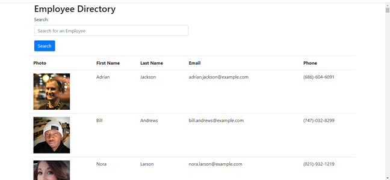

## Employee Directory
This poject uses the React stack to render a web applicatio that uses an API to call random employees. This information is displayed in ta table with first name, last name, email address and telephone number as well as photo.	

## Developer	

     1. Chidi Onyeabo	

          [LinkedIn Profile](https://linkedin.com/in/franklin-onyeabo-b168631a1)

          [Github Portfolio](https://fonyeabo12.github.io/)	

          [GitHub addresss](https://github.com/fonyeabo12)	

## Technologies	
* HTML	
* CSS	
* React	
* JavaScript	
* Randomuser.me API	

## Installation	The page will reload if you make edits.
You will also see any lint errors in the console.

This application is run by first running yarn install into your machine. This is followed by yarn start to run the react app.	### `yarn test`

##Image	

